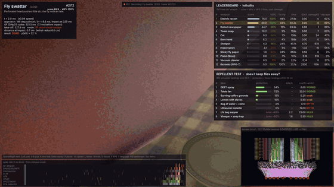
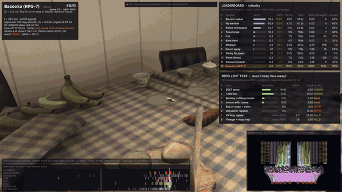
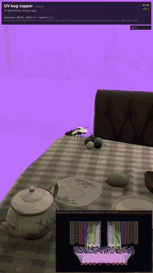
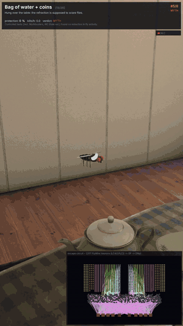
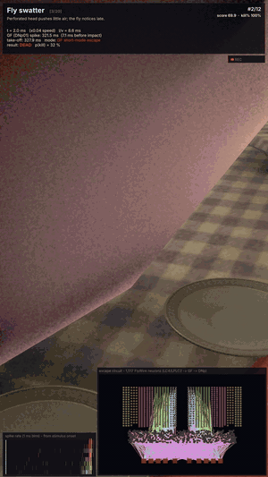

# FlyWireSwat 🪰

**A real fly brain versus every way to kill a fly.**

FlyWireSwat loads the looming-escape circuit of *Drosophila* straight out of the open
[FlyWire](https://flywire.ai) connectome (FAFB v783, 1,517 neurons, 275k synapses), simulates it as a
spiking network in Unity 6, and throws an arsenal at it - bare hand, newspaper, swatter, electric racket,
towel, vacuum cleaner, insect spray, fly paper, a cat, a pistol, a shotgun and an RPG-7 - hundreds of times
each, to find the **optimal fly-killing method**. A second test checks folk remedies (bag of water, coffee
smoke, DEET, lemon + cloves, ultrasonic gadgets, a fan, vinegar traps, UV zappers) for whether they really
keep flies away. Then you can grab the weapons yourself in a first-person kitchen where the same brain runs
in real time.

*Türkçe özet için aşağı kaydır → [Türkçe](#türkçe).*

<p align="center">
  
  
</p>
<p align="center">
  
  
  
  
</p>

## Results (150 trials per weapon, 30-minute budget)

| # | Weapon | Score | Kill rate | Mean time to kill | Cost / kill | Collateral |
|--:|--------|------:|----------:|------------------:|------------:|-----------:|
| 1 | Electric racket | 76.5 | 100% | 28 s | $0.00 | $0 |
| 2 | Fly swatter | 69.9 | 100% | 40 s | $0.00 | $0 |
| 3 | Rolled newspaper | 44.7 | 96% | 93 s | $0.00 | $1 |
| 4 | Towel snap | 10.2 | 59% | 159 s | $0.00 | $7 |
| 5 | Cat | 9.3 | 59% | 139 s | $0.00 | $34 |
| 6 | Bare hand | 8.2 | 53% | 168 s | $0.00 | $0 |
| 7 | Shotgun | 4.3 | 86% | 45 s | $4.70 | $978 |
| 8 | Insect spray | 3.1 | 35% | 115 s | $1.32 | $16 |
| 9 | Sticky fly paper | 1.0 | 34% | 850 s | $0.50 | $0 |
| 10 | Pistol (9 mm) | 0.8 | 43% | 107 s | $5.19 | $519 |
| 11 | Vacuum cleaner | 0.3 | 11% | 221 s | $0.14 | $0 |
| 12 | Bazooka (RPG-7) | 0.03 | 100% | 20 s | $2,500 | $150,000 |

Score = kill-rate² × 100 / ((1 + T/60 s)^0.7 · √(1 + cost $) · √(1 + collateral $/50)).
The bazooka is the only weapon the fly *never* sees coming (l/v = 0.3 ms, well under the ~8 ms Giant Fiber
latency) - it just costs a house. Fast, wide, quiet weapons (racket, swatter) win because the fly's escape is
triggered mostly during the slow wind-up, not the strike. Full CSV/JSON in `Results/`.

Repellent test (24 simulated hours, landings within 50 cm of the item): fan **~72 % protection**, DEET ~50 %,
lemon + cloves ~22 %, coffee smoke ~18 %, water bag **0 %** (myth), ultrasonic **0 %** (myth); the vinegar trap
and the UV zapper do not repel but *attract and kill* (`Results/repellents_latest.csv`).

## How the brain works

* **Data** - `Tools/extract_escape_circuit.py` pulls LC4, LPLC2, LPLC1, LC6, LC16, LC22, LC15 visual
  projection neurons, the Giant Fiber (DNp01) and the DNp02/04/06/11 descending neurons, plus everything
  that synapses onto those descending neurons with ≥10 synapses, from the FlyWire v783 tables
  (no login needed, see `Tools/fetch_assets.sh`). LC4 and LPLC2 come out as the two strongest GF inputs,
  exactly as in Ache et al. 2019.
* **Model** - leaky integrate-and-fire (Shiu et al. 2024, *Nature*): τ = 20 ms, V_rest = −52 mV,
  V_th = −45 mV, 2.2 ms refractory, 0.275 mV per synapse, ACh excitatory, GABA/Glu inhibitory. Runs in
  Burst-compiled jobs (`Assets/Scripts/Connectome/LifKernel.cs`).
* **Sensory input** - each weapon is an object of radius *r* approaching at speed *v* (slow wind-up, then the
  strike). Its angular size θ(t) and expansion rate drive LC4 (velocity-tuned) and LPLC2 (size-tuned) with
  left/right eye weighting, reduced visibility from behind, and a 35 % chance the fly is distracted.
* **Escape** - a GF spike triggers the 7 ms "short mode" jump (uncoordinated); accumulated descending activity
  without GF triggers the ~90 ms "long mode" (wings up, jump away from the threat). Von Reyn et al. 2014,
  Card & Dickinson 2008.
* **Outcome** - take-off time + jump kinematics vs. the weapon's impact time, lethal radius and human aim error;
  misses are retried (reload, wait for the fly to land again) inside a 30-minute budget.

`Tools/lif_reference.py` is a numpy mirror of the kernel for calibration without Unity.

## Running it

Requirements: Unity 6 (6000.x) with URP, Python 3, curl, ffmpeg (for videos), Blender (optional, for the
procedural props).

```bash
git clone https://github.com/Batushn/FlyWireSwat && cd FlyWireSwat
./Tools/fetch_assets.sh        # CC0 assets + FlyWire tables (~200 MB)
```

Open the project in Unity, run **FlyWireSwat → Import Third-Party Assets**, open
`Assets/Scenes/FlyWireSwat.unity`, press Play. Menu:

1. **Benchmark + showcase** - runs (or loads the cached) benchmark, then replays each weapon in slow motion
   with a cinematic camera, live neuron activity, GF-spike marker and the two leaderboards.
   `Space/→` next · `←` prev · `1-9` pick · `R` new trial · `Enter` replay · `P` pause · `+/-` speed ·
   `L` tables · `B` brain · `V` record videos · `F` FPS · `T` language · `F5` re-run · `Esc` menu.
2. **FPS mode** - WASD + mouse, `1-9/0`, `Q/E` or wheel to pick an item, left click to attack or place a
   repellent (water bag, coffee, DEET, lemon, ultrasonic box, fan, vinegar trap, UV zapper). The connectome
   runs every frame on what the fly sees from your hand; the wall panel shows the spikes.
3. **Record videos** - 60 fps PNG capture → ffmpeg; `Videos/landscape/` or `Videos/portrait/` depending on
   the window. From a build: `FlyWireSwat.x86_64 -record -portrait -videoseconds=12` (also `-landscape`,
   `-fps`, `-showcase`, `-en`, `-tr`).

Editor menu: **Build Kitchen Scene** (regenerates the room - it deletes your manual edits), **Build Linux
Player**, **Game View 1920x1080**, **Create Weapon Assets** (ScriptableObjects you can tune in the Inspector).

## Project layout

```
Assets/Scripts/Connectome   JSON loader, CSR network, Burst LIF kernel + jobs, live brain job
Assets/Scripts/Fly          loom geometry, escape model, procedural fly
Assets/Scripts/Weapons      WeaponDefinition (killers + repellents), default library
Assets/Scripts/Sim          trial engine, repellent engine, stats/export, showcase, HUD, recorder, FX, i18n
Assets/Scripts/Fps          player, weapon controller, live fly, repellent zones
Assets/Editor/FlyWireSwat   asset importer, kitchen builder, build/menu helpers
Tools/                      data extraction, asset fetching, Blender prop generator, numpy reference
```

## Credits & licenses

Code: MIT. Connectome: FlyWire FAFB v783 (Dorkenwald et al., Nature 2024; Schlegel et al., Nature 2024),
CC-BY 4.0. Models/textures/HDRI: Poly Haven (CC0), Kenney Blaster Kit (CC0), props generated with Blender.
Font: Inter (OFL). See `LICENSE` and the `CREDITS.md` files under `Assets/ThirdParty/`.

Caveats: the sensory gains and escape latencies are hand-calibrated to published numbers, not fitted to
behavioural data; weapon parameters are rough estimates. It is a science-flavoured toy, not a paper.

---

## Türkçe

**Gerçek bir sinek beyni vs. sinek öldürmenin her yolu.**

Açık kaynak FlyWire connectome'undan (FAFB v783) çıkarılan kaçış devresi (LC4/LPLC2 → Giant Fiber → iniş
nöronları, 1.517 nöron) Unity 6'da Burst ile spiking (LIF) olarak simüle edilir; el, gazete, sineklik,
elektrikli raket, havlu, süpürge, sinek ilacı, sinek kağıdı, kedi, tabanca, pompalı ve bazuka yüzlerce
denemede test edilip **en optimize sinek öldürme yöntemi** bulunur. Ayrı bir **kovuculuk testi** batıl
inançları sınar: sirkeli su torbası ve ultrasonik kovucu **şehir efsanesi** (%0), kahve dumanı ve
limon-karanfil zayıf, DEET orta, vantilatör **işe yarıyor** (~%72), sirke tuzağı ve mor ışık (UV) kovmaz ama
çeker ve öldürür. FPS modunda aynı beyin gerçek zamanlı çalışırken silahları kendin deneyebilir, kovucuları
masaya yerleştirebilirsin.

Kurulum: `./Tools/fetch_assets.sh`, Unity'de **FlyWireSwat → Import Third-Party Assets**, sahneyi aç, Play.
Menüden dili `T` ile Türkçe yapabilirsin. Ayrıntılar yukarıdaki İngilizce bölümde.
